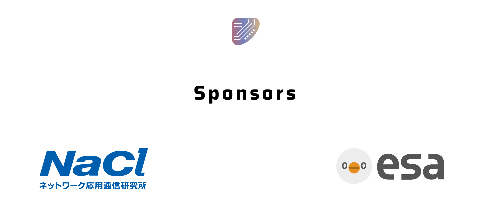
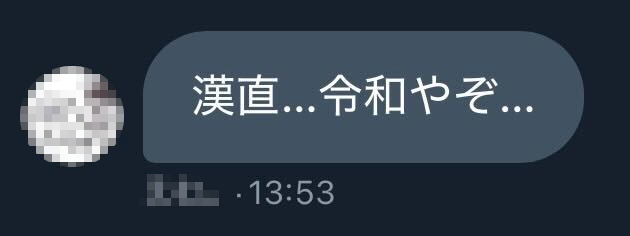
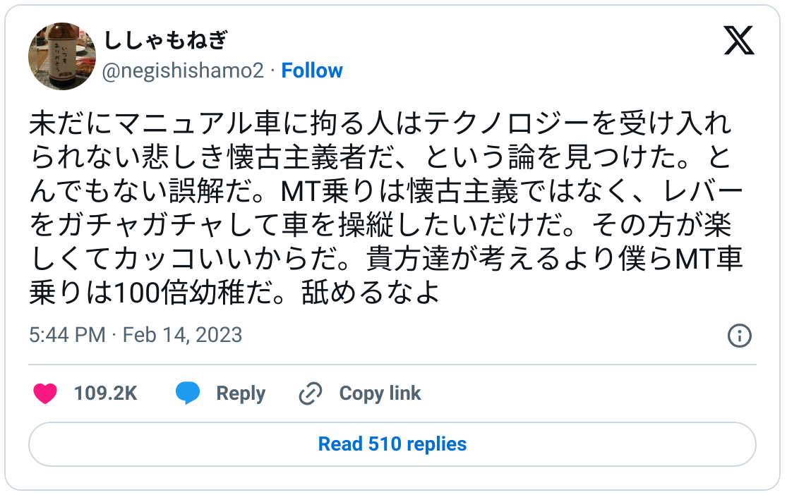
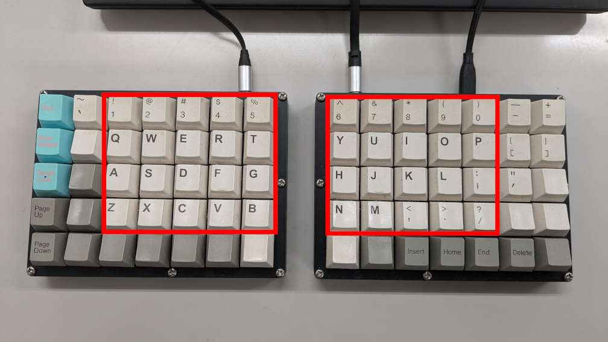
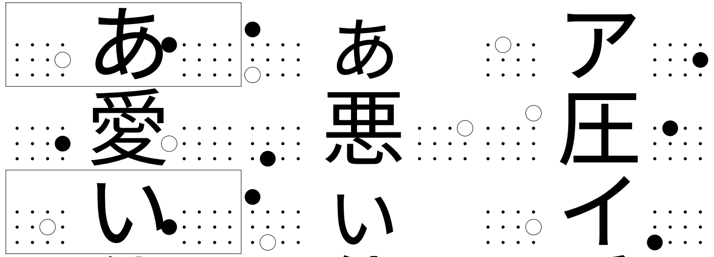
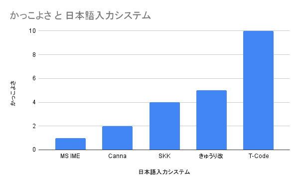

# 漢字直接入力のすすめ

前田 修吾  
株式会社ネットワーク応用通信研究所

## 協賛

## 本日のテーマ

* 漢字直接入力のすすめ

## 実行委員からのおことば

## 懐古主義?

## KeebKaigi 2023の狭ピッチトーク

* [Why are number keys important?](https://shugo.net/tmp/keebkaigi2023-tcode.pdf)
  * PRK Firmware上でT-Codeを実装して漢字入力する話

## 誤解

> 「皆さんキーボードからIMEを介在せずに漢字変換したいですよね」  
> ↓  
> unicodeを入力し始める

> 漢字を 入力するために，Unicodeの コードポイントを 全部 覚えるのは，無理が あります。

## 漢字直接入力(漢直)とは

* 日本語入力法の一種
* かな漢字変換と違い、かなを経由せずに直接入力したい漢字を指定する

## 連想式 vs 無連想式

* 連想式
  * キーストロークから漢字を連想できる
  * 例: アイ→愛、レタ→字、イヒ→化
* 無連想式
  * キーストロークから漢字を連想できない
  * 例: fh→愛、z/→字、mv→化

## T-Code

* 無連想式漢字直接入力

## 使用するキー

## 漢字との対応

* 左手側20キー・右手側20キーの2ストロークの組合せ
    * 40 x 40 = 1600
* 特殊コマンドなど未割り当て分を除く1357字を表現

## 橋田表

## PRK Firmwareで何をやったか

* IBusのUnicode入力機能
  * Ctrl+Shift+u 6F22 Space → 漢(U+6F22)
* PRK Firmware上でT-Codeのキー入力を上記のキー入力に変換
  * l4 → Ctrl+Shift+u 6F22 Space

## 実用になるの?

* 1357字も覚えられる?
* それ以外の文字は?
  * 例えば「吾」は1357字に含まれない

## 逃げ道

* 部首合成
* 交ぜ書き変換

## 部首合成

* jfと打つと、直前の漢字二文字を合成
* 例: 五口jf→吾

## 交ぜ書き変換

* fjと打つと、かな漢字交じりの単文節変換ができる
* 例: かん字fj→漢字
* 一部漢字なので候補を少なくできる

## T-Codeのメリット

* かっこいい
* 気持ちいい
* 実装が簡単

## かっこいい

## 気持ちいい

* かな漢字変換のストレス
  * 文節の区切り間違い
  * 変換間違い
  * ATのキックダウンみたいな
* 操作した通りに入力される
  * 間違ったら自分のせい

## 実装が簡単

* 基本機能は2ストロークのキー入力と漢字の対応付けだけ
* mozcなどのかな漢字変換のローマ字テーブルでも実装できる
* キーボードファームウェアにも載る

## T-Codeのデメリット

* 別に速くはない
* あまり使わない文字を忘れがち
* typoがやばい

## 別に速くはない

* プロはかな漢字変換で候補の順序を固定して覚えているらしい

## あまり使わない文字を忘れがち

* 「ヴ」とか「ェ」とか度忘れする
* 無連想式なので考えても思い出せない
  * よく使う単語とかの流れで思い出せることも

## typoがやばい

* お願(v7)いします→お疑(7v)いします
* 研究所(oz)→研究殺(zo)

## T-Codeの主な実装

* tc.el (Emacs用)
  * https://github.com/kanchoku/tc
* Textbringer (T-Codeが組み込まれたテキストエディタ)
  * https://github.com/shugo/textbringer
* mozc-tcode-table (mozc用ローマ字テーブル)
  * https://github.com/kanchoku/mozc-tcode-table
* prk_runner3680_5x7_tcode (PRK Firmware用キーマップ)
  * https://github.com/shugo/prk_runner3680_5x7_tcode

## まとめ

* 漢字直接入力やMTは別に速くないけど気持ちいい
